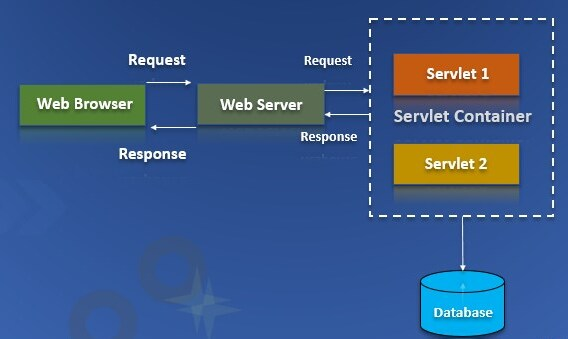
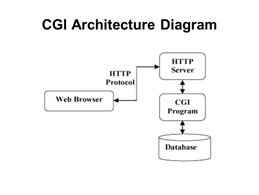
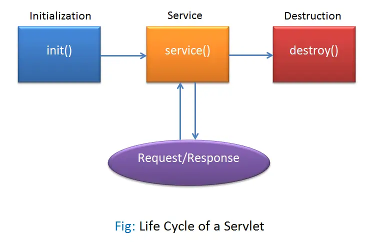

<div align="center">

[**_``Go Back``_**](../README.md)

# Servlet and JSP

</div>

## Background
---------------
``Servlet`` and ``JavaServer Pages (JSP)`` are technologies used in Java-based web development to create dynamic web applications. They are both part of the ``Java Enterprise Edition (Java EE)`` platform, now known as ``Jakarta EE``, which provides a set of APIs and tools for building enterprise-level applications.

### **Servlet:**

A servlet is a Java class that extends the capabilities of a web server. It allows you to handle requests and responses in a web application. Servlets are the foundation of Java-based web applications and provide a way to generate dynamic content, process form data, manage sessions, and interact with databases.

In other words, Servlets are the Java programs that run on the Java-enabled web server, ``servlet container`` or application server. They are used to handle the request obtained from the webserver, process the request, produce the response, then send a response back to the webserver. 

> A ``servlet container``, also known as a ``servlet engine`` or web container, is a critical component of Java-based web applications. It provides the runtime environment and infrastructure for executing servlets, managing their lifecycle, and handling client requests and responses. 

<div align="center">



</div>


Key features of servlets:

- **Lifecycle**: Servlets have a well-defined lifecycle, including methods like **``init()``**, **``service()``**, and **``destroy()``**, which are called at different stages.

- **Request and Response Handling**: Servlets can handle ``HTTP requests`` and generate ``HTTP responses``. They can read data from request parameters, headers, and input streams, and write data to the response output stream.

- **Multithreading**: Servlet containers manage the lifecycle of servlets and handle concurrent requests by creating multiple threads.

- **URL Mapping**: Servlets are mapped to specific URLs, allowing you to define how different URLs are processed by different servlets.

### **CGI(Common Gateway Interface)**

The ``Common Gateway Interface (CGI)`` is a standard protocol that allows web servers to communicate with external programs (often scripts) to generate dynamic content or perform specific tasks in response to client requests. ``CGI`` acts as a bridge between the web server and these external programs, enabling the creation of dynamic and interactive web applications.

> **Note** : In computing, ``Common Gateway Interface (CGI)`` is an interface specification that enables web servers to execute an external program to process HTTP/S user requests.

<div align="center">



</div>

## The Life Cycle of a Servlet
------------------------------
A ``Servlet`` life cycle can be defined as the entire process from its creation till the destruction. 

The entire life cycle of a ``Servlet`` is managed by the Servlet container which uses the ``javax.servlet.Servlet`` interface to understand the Servlet object and manage it. So, before creating a ``Servlet`` object, let’s first understand the life cycle of the Servlet object which is actually understanding how the ``Servlet container`` manages the ``Servlet`` object.


<div align="center">



</div>


### **Stages of the Servlet Life Cycle** 

The Servlet life cycle mainly goes through four stages

- **Loading a Servlet.**
- **Initializing the Servlet.**
- **Request handling.**
- **Destroying the Servlet.**

Let’s look at each of these stages in details:

#### Loading a Servlet: 
The first stage of the Servlet lifecycle involves loading and initializing the Servlet by the Servlet container. The Web container or Servlet Container can load the Servlet at either of the following two stages :

- Initializing the context, on configuring the Servlet with a zero or positive integer value.
- If the Servlet is not preceding stage, it may delay the loading process until the Web container determines that this Servlet is needed to service a request.

The Servlet container performs two operations in this stage :

- **Loading** : Loads the ``Servlet`` class.
- **Instantiation** : Creates an instance of the ``Servlet``. To create a new instance of the ``Servlet``, the container uses the no-argument constructor.

#### Initializing a Servlet:
After the ``Servlet`` is instantiated successfully, the ``Servlet container`` initializes the instantiated ``Servlet`` object. The container initializes the ``Servlet`` object by invoking the **``Servlet.init(ServletConfig)``** method which accepts ``ServletConfig`` object reference as parameter.

The ``Servlet`` container invokes the **``Servlet.init(ServletConfig)``** method only once, immediately after the **``Servlet.init(ServletConfig)``** object is instantiated successfully. This method is used to initialize the resources, such as ``JDBC`` datasource.

Now, if the ``Servlet`` fails to initialize, then it informs the ``Servlet container`` by throwing the ``ServletException`` or ``UnavailableException``.

#### Handling request:
After initialization, the ``Servlet`` instance is ready to serve the client requests. The ``Servlet container`` performs the following operations when the ``Servlet`` instance is located to service a request :

- It creates the ``ServletRequest`` and ``ServletResponse`` objects. In this case, if this is a HTTP request, then the Web container creates ``HttpServletRequest`` and ``HttpServletResponse`` objects which are subtypes of the ``ServletRequest`` and ``ServletResponse`` objects respectively.
- After creating the ``request`` and ``response`` objects it invokes the **``Servlet.service(ServletRequest, ServletResponse)``** method by passing the ``request`` and ``response`` objects.

The **``service()``** method while processing the request may throw the ``ServletException`` or ``UnavailableException`` or ``IOException``.

#### Destroying a Servlet:
 
When a ``Servlet container`` decides to destroy the ``Servlet``, it performs the following operations,

- It allows all the threads currently running in the service method of the ``Servlet`` instance to complete their jobs and get released.

- After currently running threads have completed their jobs, the ``Servlet`` container calls the **``destroy()``** method on the ``Servlet`` instance.

After the **``destroy()``** method is executed, the ``Servlet`` container releases all the references of this ``Servlet`` instance so that it becomes eligible for garbage collection.

### **Servlet Life Cycle Methods**

The life cycle methods of a ``Servlet`` are :

- **``init()``**
- **``service()``**
- **``doGet()`` [Optional]**
- **``doPost()`` [Optional]**
- **``destroy()``**


#### **``init()``**:

- The **``init()``** method is called when the servlet is first created by the servlet container. It is typically used for one-time initialization tasks. 

- This method is called once during the servlet's lifecycle.

**Signature:**

```Java
public void init(ServletConfig config) throws ServletException
```

**Example:**

```Java
@Override
public void init(ServletConfig config) throws ServletException {
    // Initialization code here
    super.init(config);
    System.out.println("Servlet initialized.");
}
```

#### **``service()``**:

- The **``service()``** method is called to handle each client request. It receives the client's request and generates the appropriate response.

- This method is called multiple times during the servlet's lifecycle, once for each request.

**Signature:** 

```Java
protected void service(HttpServletRequest request, HttpServletResponse response) throws ServletException, IOException
```


**Example:**

```Java
@Override
protected void service(HttpServletRequest request, HttpServletResponse response) throws ServletException, IOException {
    // Service code here
    response.setContentType("text/html");
    PrintWriter out = response.getWriter();
    out.println("<html><body>");
    out.println("<h1>Hello World</h1>");
    out.println("</body></html>");
}
```

#### **``doGet()``**:

- The **``doGet()``** method is an HTTP-specific convenience method that is called by the **``service()``** method when an HTTP ``GET`` request is received. It is used to handle ``GET`` requests. It's used to handle requests that retrieve information from the server.

**Signature:** 

```Java
protected void doGet(HttpServletRequest request, HttpServletResponse response) throws ServletException, IOException
```


**Example:**

```Java
@Override
protected void doGet(HttpServletRequest request, HttpServletResponse response) throws ServletException, IOException {
    response.setContentType("text/html");
    PrintWriter out = response.getWriter();
    out.println("<html><body>");
    out.println("<h1>Hello World - From Get Response</h1>");
    out.println("</body></html>");
}
```

#### **``doPost()``**:

- This method is called when an HTTP ``POST`` request is received by the servlet. It's used to handle requests that send data to the server, typically used for submitting forms or updating data.

**Signature:** 

```Java
protected void doPost(HttpServletRequest request, HttpServletResponse response) throws ServletException, IOException
```


**Example:**

```Java
@Override
protected void doPost(HttpServletRequest request, HttpServletResponse response) throws ServletException, IOException {
    response.setContentType("text/html");
    String firstName = request.getParameter("firstName");
    String lastName = request.getParameter("lastName");
    PrintWriter out = response.getWriter();
    out.println("<html><body>");
    out.println("<h1>Hello " + firstName + " " + lastName + "!</h1>");
    out.println("</body></html>");
}
```
#### **`` destroy()``**:

- The **``destroy()``** method is called by the servlet container when the servlet is being removed from service. It is used for cleanup tasks and releasing resources.

- This method is called once during the servlet's lifecycle, typically when the web application is shutting down.

**Signature:** 

```Java
public void destroy()
```


**Example:**

```Java
@Override
public void destroy() {
    // Cleanup code here
    System.out.println("Servlet is being destroyed.");
}
```

## The Simple Servlet
-----------------------

```Java
import java.io.IOException;
import java.io.PrintWriter;
import javax.servlet.ServletConfig;
import javax.servlet.ServletException;
import javax.servlet.http.HttpServlet;
import javax.servlet.http.HttpServletRequest;
import javax.servlet.http.HttpServletResponse;

public class SimpleServlet extends HttpServlet {

    String title, content;

    @Override
    public void init(ServletConfig config) throws ServletException {
        super.init(config);
        System.out.println("Initialization");
        title = "My Servlet";
        content = "This is Example of Simple Servlet";
    }

    @Override
    protected void service(HttpServletRequest request, HttpServletResponse response) throws ServletException, IOException {
        processRequest(request, response);
    }

    protected void processRequest(HttpServletRequest request, HttpServletResponse response) throws ServletException, IOException {
        response.setContentType("text/html;charset=UTF-8");
        try (PrintWriter out = response.getWriter()) {
            out.println("<!DOCTYPE html>");
            out.println("<html>");
            out.println("<head>");
            out.println("<title>" + title + "</title>");
            out.println("</head>");
            out.println("<body>");
            out.println("<h1>" + content + "</h1>");
            out.println("</body>");
            out.println("</html>");
            out.close();       
        }
    }

    @Override
    public void destroy() {
        System.out.println("Destruction");
    }

}
```
## The Servlet API
-----------------------
Servlets are the Java programs that run on the Java-enabled web server or application server. They are used to handle the request obtained from the webserver, process the request, produce the response, then send a response back to the webserver. In Java, to create web applications we use Servlets. Servlets are Java classes that handle HTTP requests and generate responses. 

> Note: The Java Servlet API provides a set of classes and interfaces that allows you to build dynamic web applicationssss in Java. 

To create Java Servlets, we need to use Servlet API which contains all the necessary interfaces and classes. Servlet API has 2 packages namely.

- ``javax.servlet``: contains many interfaces and classes that are used by the servlet or web container. These are not specific to any protocol.

- ``javax.servlet.http``:  contains interfaces and classes that are responsible for http requests only.

### **``javax.servlet`` package**

``javax.servlet`` is a Java package that is part of the Java Servlet API, which provides classes and interfaces for creating servlets, which are Java-based components used for building web applications. Servlets are designed to handle requests and responses in a web server environment.

- This package provides the number of interfaces and classes to support Generic servlet which is protocol independent.

- These interfaces and classes describe and define the contracts between a servlet class and the runtime environment provided by a servlet container.

**Classes available in ``javax.servlet`` package:**

- ``GenericServlet`` : To define a generic and protocol-independent servlet.

- ``ServletContextAttributeEvent`` : To generate notifications about changes to the attributes of the servlet context of a web application.

- ``ServletContextEvent`` : To generate notifications about changes to the servlet context of a web application.

- ``ServletInputStream`` : This class provides an input stream to read binary data from a client request.

- ``ServletOutputStream`` : This class provides an output stream for sending binary data to the client.

- ``ServletRequestAttributeEvent`` : To generate notifications about changes to the attributes of the servlet request in an application.

- ``ServletRequestEvent`` : To indicate lifecycle events for a ServletRequest.

- ``ServletRequestWrapper`` : This class provides the implementation of the ``ServletRequest`` interface that can be subclassed by developers to adapt the request to a Servlet.

- ``ServletResponseWrapper`` : This class provides the implementation of the ``ServletResponse`` interface that can be subclassed by developers to adapt the response from a Servlet.

**Interfaces available in ``javax.servlet`` package:**

- ``Filter`` : To perform filtering tasks on either the request to a resource, or on the response from a resource, or both.

- ``FilterChain`` : To provide a view into the invocation chain of a filtered request for a resource to the developer by the servlet container.

- ``FilterConfig`` : To pass information to a filter during initialization used by a servlet container.

- ``RequestDispatcher`` : It defines an object to dispatch the request and response to any other resource, means it receives requests from the client and sends them to a servlet/HTML file/JSP file on the server.

- ``Servlet`` : This is the main interface that defines the methods in which all the servlets must implement. To implement this interface, write a generic servlet that extends ``javax.servlet.GenericServlet`` or an HTTP servlet that extends ``javax.servlet.http.HttpServlet``.

- ``ServletConfig`` : It defines an object created by a servlet container at the time of servlet instantiation and to pass information to the servlet during initialization.

- ``ServletContext`` : It defines a set of methods that a servlet uses to communicate with its servlet container. The information related to the web application available in ``web.xml`` file is stored in ServletContext object created by container.

- ``ServletContextAttributeListener`` : The classes that implement this interface receive notifications of changes to the attribute list on the servlet context of a web application.

- ``ServletContextListener`` : The classes that implement this interface receive notifications about changes to the servlet context of the web application they are part of.

- ``ServletRequest`` : It defines an object that is created by servlet container to pass client request information to a servlet.

- ``ServletRequestAttributeListener`` : To generate the notifications of request attribute changes while the request is within the scope of the web application in which the listener is registered.

- ``ServletRequestListener`` : To generate the notifications of requests coming in and out of scope in a web component.

- ``ServletResponse`` : It defines an object created by servlet container to assist a servlet in sending a response to the client.

**Exceptions in ``javax.servlet`` package:**

- ``ServletException`` : A general exception thrown by a servlet when it encounters difficulty.

- ``UnavailableException`` : Thrown by a servlet or filter to indicate that it is permanently or temporarily unavailable.

### **``javax.servlet.http`` package**

The ``javax.servlet.http`` package is a subpackage of the Java Servlet API that extends the basic servlet functionality to provide classes and interfaces specifically tailored for handling HTTP requests and responses. This package is used to build web applications that interact with clients over the HTTP protocol.

- This package provides the number of interfaces and classes to support HTTP servlet which is HTTP protocol dependent.

- These interfaces and classes describe and define the contracts between a servlet class running under HTTP protocol and the runtime environment provided by a servlet container.

**Classes available in ``javax.servlet.http`` package:**

- ``Cookie`` : Creates a cookie object. It is a small amount of information sent by a servlet to a Web browser, saved by the browser, and later sent back to the server used for session management.

- ``HttpServlet`` : Provides an abstract class that defines methods to create an HTTP suitable servlet for a web application.

- ``HttpServletRequestWrapper`` : This class provides implementation of the 

- ``HttpServletRequest`` : interface that can be subclassed to adapt the request to a Servlet.

- ``HttpServletResponseWrapper`` : This class provides implementation of the 

- ``HttpServletResponse`` : interface that can be subclassed to adapt the response from a Servlet.

- ``HttpSessionBindingEvent`` : This events are either sent to an object that implements ``HttpSessionBindingListener`` when it is bound or unbound from a session, or to a ``HttpSessionAttributeListener`` that has been configured in the deployment descriptor when any attribute is bound, unbound or replaced in a session.

- ``HttpSessionEvent`` : To represent event notifications for changes to sessions within a web application.

**Interfaces available in ``javax.servlet.http`` package:**

- ``HttpServletRequest`` : To provide client HTTP request information for servlets. It extends the ServletRequest interface.
- ``HttpServletResponse`` : To provide HTTP-specific functionality in sending a response to client. It extends the ServletResponse interface.
- ``HttpSession`` : It provides a way to identify a user across web application/web site pages and to store information about that user.
- ``HttpSessionActivationListener`` : Container to notify all the objects that are bound to a session that sessions will be passivated and that session will be activated.
- ``HttpSessionAttributeListener`` : To get notifications of changes to the attribute lists of sessions within this web application, this listener interface can be implemented.
- ``HttpSessionBindingListener`` : It causes an object to be notified by an ``HttpSessionBindingEvent`` object, when it is bound to or unbound from a session.
- ``HttpSessionListener`` : To receive notification events related to the changes to the list of active sessions in a web application.

### **Reading Servlet Parameters**
Reading servlet parameters in a Java web application typically involves accessing values passed as part of an ``HTTP`` request. Servlets can retrieve these parameters from the request object and then use them for processing. There are two main ways to read servlet parameters: from the **query string (``GET`` request)** and from the **request body (``POST`` request)**.

#### Reading Parameters from the Query String (GET Request):
When parameters are sent in the URL's query string (e.g., ``http://example.com/servlet?param1=value1&param2=value2``), you can use the **``request.getParameter()``** method to retrieve them. Here's an example:

```Java
import java.io.IOException;
import javax.servlet.ServletException;
import javax.servlet.annotation.WebServlet;
import javax.servlet.http.HttpServlet;
import javax.servlet.http.HttpServletRequest;
import javax.servlet.http.HttpServletResponse;

@WebServlet("/MyServlet")
public class MyServlet extends HttpServlet {
    protected void doGet(HttpServletRequest request, HttpServletResponse response) throws ServletException, IOException {
        String param1 = request.getParameter("param1");
        String param2 = request.getParameter("param2");

        // Now, you can use param1 and param2 for processing
    }
}
```
#### Reading Parameters from the Request Body (POST Request):
When parameters are sent as part of a ``POST`` request (e.g., through a form submission), you can still use **``request.getParameter()``** to read them. However, you should make sure your ``HTML`` form is set to use the ``POST`` method, and you should access the parameters after a form submission. Here's an example:

```Java
import java.io.IOException;
import javax.servlet.ServletException;
import javax.servlet.annotation.WebServlet;
import javax.servlet.http.HttpServlet;
import javax.servlet.http.HttpServletRequest;
import javax.servlet.http.HttpServletResponse;

@WebServlet("/MyServlet")
public class MyServlet extends HttpServlet {
    protected void doPost(HttpServletRequest request, HttpServletResponse response) throws ServletException, IOException {
        String param1 = request.getParameter("param1");
        String param2 = request.getParameter("param2");

        // Now, you can use param1 and param2 for processing
    }
}
```

### **Handeling HTTP Request and Response**

#### HTTP Request 

##### ``javax.servlet.http.HttpServletRequest``

The ``javax.servlet.http.HttpServletRequest`` interface is part of the Java Servlet API and is used to represent an HTTP request made to a servlet. It provides methods to access various aspects of an HTTP request, including request parameters, headers, cookies, and session information. Servlets use this interface to extract data from incoming HTTP requests and to interact with the client.

Here are some common methods and functionalities provided by the ``HttpServletRequest`` interface:

- Accessing Request Information:
    - **``getMethod()``**: Returns the HTTP method of the request (e.g., GET, POST).
    - **``getRequestURI()``**: Returns the URI of the request.
    - **``getQueryString()``**: Returns the query string of the request URL.
    - **``getProtocol()``**: Returns the name and version of the protocol.
    - **``getRemoteAddr()``**: Returns the IP address of the client.
    - **``getHeader(String name)``**: Returns the value of a specified request header.

- Reading Request Parameters:
    - **``getParameter(String name)``**: Returns the value of a request parameter identified by its name.
    - **``getParameterNames()``**: Returns an Enumeration of all parameter names.
    - **``getParameterValues(String name)``**: Returns an array of values for a request parameter.
    - **``getParameterMap()``**: Returns a map of all request parameters.

- Handling Cookies:
    - **``getCookies()``**: Returns an array of ``javax.servlet.http.Cookie`` objects representing cookies in the request.

- Session Management:
    - **``getSession()``**: Returns the current HttpSession associated with the request.
    - **``getSession(boolean create)``**: Returns the current HttpSession, optionally creating one if it doesn't exist.

- Accessing Request Attributes:
    - **``getAttribute(String name)``**: Returns the value of a request attribute.
    - **``setAttribute(String name, Object value)``**: Sets a request attribute.

- Reading the Request Body (for POST requests):
    - To read data sent in the request body, you can obtain an ``InputStream`` using **``getInputStream()``** or a ``BufferedReader`` using **``getReader()``**.

- Forwarding and Including Requests:
    - **``getRequestDispatcher(String path)``**: Returns a ``RequestDispatcher`` for forwarding or including the request.

- Security Information:
    - **``isSecure()``**: Returns true if the request was made using a secure (HTTPS) connection.

Multipart Form Data (file uploads):
    - **``getPart(String name)``**: Retrieves a Part object for processing file uploads in a multipart/form-data request.

##### Handeling Request

###### Read Request Parameters:
Use **``request.getParameter()``** to read parameters from the request, if applicable. This allows you to retrieve data sent by the client as part of the request.

```Java
String param1 = request.getParameter("param1");
String param2 = request.getParameter("param2");
```

###### Process the Request:
Write code to process the request. This could include data validation, business logic, or database operations based on the information received in the request.

```Java
if (param1 != null && param2 != null) {
    // Perform some operations with the parameters
}
```

#### HTTP Response

##### ``javax.servlet.http.HttpServletResponse``

The ``javax.servlet.http.HttpServletResponse`` interface is part of the Java Servlet API and is used to represent the response that a servlet sends back to the client (typically a web browser) after processing an HTTP request. It provides methods for setting response headers, content type, status codes, and sending data back to the client. Here are some common methods and functionalities provided by the ``HttpServletResponse`` interface:

- Setting Response Headers:
    - **``setHeader(String name, String value)``**: Sets a response header with the given name and value.
    - **``addHeader(String name, String value)``**: Adds a response header with the given name and value.
    - **``setIntHeader(String name, int value)``**: Sets an integer response header.
    - **``addIntHeader(String name, int value)``**: Adds an integer response header.
    - **``setDateHeader(String name, long date)``**: Sets a date response header.
    - **``addDateHeader(String name, long date)``**: Adds a date response header.

- Setting the Content Type:
    - **``setContentType(String type)``**: Sets the content type of the response (e.g., "text/html", "application/json").
    - **``setCharacterEncoding(String charset)``**: Sets the character encoding for the response content.

- Setting the Response Status:
    - **``setStatus(int sc)``**: Sets the HTTP status code for the response (e.g., 200 for OK, 404 for Not Found).
    - **``setStatus(int sc, String sm)``**: Sets the HTTP status code and a custom status message.

- Redirecting the Client:
    - **``sendRedirect(String location)``**: Redirects the client to a different URL.

- Getting the Output Stream and Writer:
    - **``getOutputStream()``**: Returns an OutputStream for writing binary data to the response.
    - **``getWriter()``**: Returns a PrintWriter for writing character data to the response.

- Flushing and Closing the Response:

    - **``flushBuffer()``**: Forces any content in the response buffer to be written to the client.
    - **``close()``**: Closes the response, indicating that no more data will be sent.

- Setting Cookies:
    - **``addCookie(Cookie cookie)``**: Adds a ``javax.servlet.http.Cookie`` to the response.

- Setting Content Length:
    - **``setContentLength(int len)``**: Sets the length of the response content.

- Content Encoding:
    - **``setCharacterEncoding(String charset)``**: Sets the character encoding for the response.

- Error Handling:

    - **``sendError(int sc)``**: Sends an error response to the client with the specified status code.
    - **``sendError(int sc, String msg)``**: Sends an error response with a custom message.

##### Handeling Response

###### Set Response Headers:
You can set various response headers using the **``response.setHeader()``** method. Common headers include **content type**, **cache control**, and **character encoding**:

```Java
response.setContentType("text/html"); // Set content type to HTML
response.setHeader("Cache-Control", "no-store, no-cache, must-revalidate"); // Example cache control
response.setCharacterEncoding("UTF-8"); // Set character encoding
```

###### Set Response Status Code:
Use the **``response.setStatus()``** method to set the ``HTTP`` status code for the response. Common status codes include ``200 (OK)``, ``404 (Not Found)``, and ``500 (Internal Server Error)``:

```Java
@Override
response.setStatus(HttpServletResponse.SC_OK); // Set status code to 200 (OK)
```

###### Write Response Content:
Use the **``response.getWriter()``** method to get a ``PrintWriter`` for writing the response content. You can also use **``response.getOutputStream()``** for binary data:

```Java
PrintWriter out = response.getWriter();
out.println("<html><body>");
out.println("<h1>Hello, Servlet!</h1>");
out.println("</body></html>");
```

###### Flush and Close Response:
It's essential to **flush** and **close** the **response writer** or **output stream** when you've finished writing the content:

```Java
out.close();
```

###### Redirecting the Client (Optional):
If you want to redirect the client to another URL, you can use the **``response.sendRedirect()``** method:

```Java
response.sendRedirect("/new-page.html");
```

###### Handling Exceptions:
Be sure to handle exceptions that may occur during response generation. Servlets typically use ``try-catch`` blocks for error handling.

```Java
@Override
protected void doGet(HttpServletRequest request, HttpServletResponse response) throws ServletException, IOException {
    try {
        // Code for generating the response
        response.setContentType("text/html"); // Set content type to HTML
        response.setHeader("Cache-Control", "no-store, no-cache, must-revalidate"); // Example cache control
        response.setCharacterEncoding("UTF-8"); // Set character encoding
        response.setStatus(HttpServletResponse.SC_OK); // Set status code to 200 (OK)
        PrintWriter out = response.getWriter();
        out.println("<html><body>");
        out.println("<h1>Hello, Servlet!</h1>");
        out.println("</body></html>");
        out.close();
    } catch (Exception e) {
        // Handle exceptions
        e.printStackTrace();
        response.sendError(HttpServletResponse.SC_INTERNAL_SERVER_ERROR, "An error occurred.");
    }
}
```

### **Using Cookies**

Using cookies in a servlet allows you to store and retrieve information on the client-side, enabling you to maintain state or remember user preferences between HTTP requests. Cookies are small pieces of data sent by the server and stored on the client's browser.

#### ``Cookie`` class
``javax.servlet.http.Cookie`` class provides the functionality of using cookies. It provides a lot of useful methods for cookies.

**Constructor:**

- **``Cookie()``** : constructs a cookie.
- **``Cookie(String name, String value)``** : constructs a cookie with a specified **name** and **value**.

**Useful Methods:**

- **``public void setMaxAge(int expiry)``** : Sets the maximum age of the cookie in seconds.
- **``public String getName()``** : Returns the name of the cookie. The name cannot be changed after creation.
- **``public String getValue()``** : Returns the value of the cookie.
- **``public void setName(String name)``** : changes the name of the cookie.
- **``public void setValue(String value)``** : changes the value of the cookie.

#### How to Use:

##### Setting Cookies:
To set a cookie in a servlet, you create a ``Cookie`` object, set its attributes (**name**, **value**, **path**, & **domain**, etc.), and add it to the **response** using the **``response.addCookie()``** method. For example:

```Java
@Override
protected void doGet(HttpServletRequest request, HttpServletResponse response) throws ServletException, IOException {
    // Create a new Cookie
    Cookie userCookie = new Cookie("username", "Prashant");
    // Set additional attributes (optional)
    userCookie.setMaxAge(3600); // Cookie will expire in 1 hour
    userCookie.setPath("/"); // Cookie is accessible from the entire website
    // Add the Cookie to the response
    response.addCookie(userCookie);
}
```

##### Reading Cookies:
To read cookies in a servlet, you can use the **``request.getCookies()``** method, which returns an array of ``Cookie`` objects sent by the client:

```Java
@Override
protected void doGet(HttpServletRequest request, HttpServletResponse response) throws ServletException, IOException {
    // Get all cookies sent by the client
    Cookie[] cookies = request.getCookies();

    if (cookies != null) {
        for (Cookie cookie : cookies) {
            String name = cookie.getName();
            String value = cookie.getValue();
            // Process the cookie data as needed
        }
    }
}
```
##### Modifying Cookies:
You can modify an existing cookie by creating a new ``Cookie`` object with the same name and updated attributes and then adding it to the response. This effectively updates the cookie on the client's side.

```Java
@Override
protected void doGet(HttpServletRequest request, HttpServletResponse response)throws ServletException, IOException {
    // Get an existing cookie by name
    Cookie[] cookies = request.getCookies();

    if (cookies != null) {
        for (Cookie cookie : cookies) {
            if ("username".equals(cookie.getName())) {
                // Update the cookie value
                cookie.setValue("Ram");
                // Set additional attributes (if needed)
                cookie.setMaxAge(3600);
                // Add the updated cookie to the response
                response.addCookie(cookie);
            }
        }
    }
}
```

##### Deleting Cookies:
To delete a cookie, you can create a new ``Cookie`` object with the same **name** and set its **maxAge** attribute to ``0`` (or a negative value) and then add it to the response:

```Java
@Override
protected void doGet(HttpServletRequest request, HttpServletResponse response) throws ServletException, IOException {
    // Delete an existing cookie by name
    Cookie[] cookies = request.getCookies();

    if (cookies != null) {
        for (Cookie cookie : cookies) {
            if ("username".equals(cookie.getName())) {
                // Delete the cookie by setting maxAge to 0
                cookie.setMaxAge(0);
                // Add the deleted cookie to the response
                response.addCookie(cookie);
            }
        }
    }
}
```

### **Session Tracking**

**Session tracking** in servlets refers to the process of maintaining state information about a user's interactions with a web application across multiple ``HTTP`` requests. This allows you to recognize and remember users between requests and is essential for building features like user authentication and maintaining user-specific data.

#### **``HttpSession``**

``HttpSession`` is an interface in the Java Servlet API that represents a user session on the server. It provides a way to store and manage user-specific information across multiple ``HTTP`` requests and responses. Sessions are used to maintain stateful interactions with clients in web applications, allowing you to recognize and remember users as they navigate through your site. Here's how to use ``HttpSession`` in a servlet:

##### Creating a Session:
To create a session, you can call the **``HttpServletRequest.getSession()``** method:

```Java
HttpSession session = request.getSession();
```

If a session already exists for the client, it will be returned; otherwise, a new session will be created. You can also pass a boolean argument to create a new session only if one doesn't already exist:

```Java
HttpSession session = request.getSession(true); // Create a new session if one doesn't exist
```

##### Storing Data in a Session:
You can store data in the session as attributes using the **``setAttribute()``** method:

```Java
session.setAttribute("username", "Prashant");
session.setAttribute("userRole", "admin");
```
The attributes are stored on the server and are associated with the user's session.

##### Retrieving Data from a Session:
To retrieve data from the session, use the **``getAttribute()``** method:

```Java
String username = (String) session.getAttribute("username");
String userRole = (String) session.getAttribute("userRole");
```
##### Removing Data from a Session:
You can remove data from the session using the **``removeAttribute()``** method:

```Java
session.removeAttribute("username");
```

This removes the specified attribute from the session.

##### Invalidating a Session:
When a session is no longer needed, you can invalidate it to release server resources. This is often done when a user logs out or after a session timeout:

```Java
session.invalidate();
```

Invalidating the session removes all attributes and marks it as invalid. Subsequent requests from the same client will create a new session.

##### Session Timeouts:
You can set a timeout period for a session. When the session remains inactive (no requests from the client) for a specified duration, it will automatically expire:

```Java
session.setMaxInactiveInterval(1800); // Set the timeout to 30 minutes (in seconds)
```

##### Checking for an Existing Session:
To check if a session already exists for a client, you can use the **``isNew()``** method:

```Java
boolean isNewSession = session.isNew();
```

This method returns ``true`` if the session is new (just created) and ``false`` if it already existed.

## Introduction to JSP
-----------------------

``JSP`` is a technology that allows you to embed Java code within HTML pages. It provides a way to create dynamic content by combining Java code with HTML markup. ``JSP`` pages are converted into servlets by the servlet container at runtime.

Key features of ``JSP``:

- **Mixing Java and HTML**: ``JSP`` pages allow you to write Java code directly within HTML tags, making it easier to generate dynamic content.

- **Implicit Objects**: ``JSP`` provides a set of predefined objects (request, response, session, application, etc.) that you can directly use in your ``JSP`` code.

- **Tag Libraries**: ``JSP`` supports custom tag libraries, which allow you to encapsulate complex behavior into reusable components.

- **Expression Language (EL)**: ``JSP`` EL allows you to embed expressions in your ``JSP`` pages, making it easier to access and manipulate data from various sources.

- **JSP Standard Actions**: ``JSP`` provides standard actions that help with tasks like including files, forwarding requests, and controlling flow.

``Servlets`` and ``JSP`` are often used together in web applications. ``Servlets`` handle the business logic and interact with the underlying systems, while ``JSP`` is used to present the data and generate the user interface. Modern web development, however, has shifted towards using more advanced technologies like ``JavaServer Faces (JSF)``, ``Spring MVC``, and various front-end frameworks. Nevertheless, servlets and JSP still provide a solid foundation for understanding web development concepts in Java.

**Simple JSP:**

```JSP
<html>
<head>
    <title>My JSP Page</title>
</head>
<body>
    <h1>Welcome to my JSP Page!</h1>
    <%=out.println("Hello, World!"); %>
</body>
</html>
```

### **JSP Tag**

In ``JavaServer Pages (JSP)``, tags are special elements that you can use to embed Java code, control flow, or dynamically generate content within an HTML or XML document. JSP tags are used to create dynamic web pages by allowing you to mix HTML or XML markup with Java code.

- **Expression Tag**
- **Scriplet Tag**
- **Directive Tag**
- **Declaration Tag**
- **Action Tag**

#### Expression Tag
We can use this tag to output any data on the generated page. These data are automatically converted to string and printed on the output stream.

```JSP
<%="HelloWorld!" %>
```
#### Scriplet Tag
In this tag we can insert any amount of valid java code and these codes are placed in the ``_jspService`` method by the JSP engine.

```JSP
<% int x = 10; %>
```

#### Directive Tag
Directive tags are used to provide instructions to the JSP container during the translation phase of the JSP page. Directive tags do not produce any output in the resulting HTML response; instead, they control various aspects of how the JSP page should be processed. There are three main types of directive tags in JSP:

- **Page Directive (``<%@ page ... %>``)** : The page directive is used to specify page-level attributes and settings for the JSP page. It typically appears at the top of the JSP file and affects the entire page. Some common attributes for the page directive include:

    - ``language``: Specifies the scripting language used in the JSP page (e.g., **"java"** for Java).
    - ``contentType``: Sets the character encoding and content type for the response (e.g., **"text/html; charset=UTF-8"**).
    - ``import``: Imports Java classes or packages for use in the JSP page.
    - ``session``: Indicates whether the page participates in sessions (**"true"** or **"false"**).
    - ``errorPage``: Specifies a JSP error page to handle exceptions.
    - ``isErrorPage``: Marks the page as an error page (**"true"** or **"false"**).
    - ``buffer``: Configures the buffering of the response output.
    - ``autoFlush``: Specifies whether to automatically flush the response buffer.

    ```JSP
    <%@ page language="java" contentType="text/html;charset=UTF-8" import="java.util.*" %>
    ```

- **Include Directive (``<%@ include ... %>``)** : The include directive is used to include the contents of another file (JSP, HTML, or text) within the current JSP page at translation time. This inclusion is done statically during the translation phase, and the included content becomes part of the current page. The included file's contents are treated as if they were part of the original JSP file. 

    ```JSP
    <%@ include file="header.jsp" %>
    ```

- **Taglib Directive (``<%@ taglib ... %>``)** : The taglib directive is used to declare and configure custom tag libraries for use within the JSP page. It specifies the URI (Uniform Resource Identifier) of the tag library, a unique prefix to associate with the library, and optional attributes like uri, prefix, and location. Custom tag libraries contain custom JSP tags that can be used to encapsulate reusable functionality and simplify JSP development.

    ```JSP
    <%@ taglib uri="http://example.com/mytags" prefix="my" %>
    ```

#### Declaration Tag

The JSP declaration tag is used to declare fields and methods.

```JSP
<%!
int y = 20;

public void printMessage() {
    out.println("Hello from JSP!");
}
%>
```

#### Action Tag:
The action tags are used to control the flow between pages and to use Java Bean. Some of the action tags supported by JSP are:

- ``jsp:forward``
- ``jsp:include``
- ``jsp:param``

Following example forwards action to another JSP page:

```JSP
<jsp: forward page = “nextpage.jsp” />
```

### **Using JSP**

#### Inserting into Database

**index.html**

```HTML
<html>
    <body>
        <form method="POST" action="insert.jsp">
            Employee Id: 
            <input type="text" name="eid"/>
            <br>
            Employee Name: <input type="text" name="name"/>
            <br>
            Employee Address: <input type="text" name="address"/>
            <br><br>
            <input type="submit" value="Insert"/>
        </form>
    </body>
</html>
```

**insert.jsp**

```JSP
<html>
<body>
    <%@ page import="java.sql.*, com.mysql.jdbc.Driver" %>
    <%
        int eid = Integer.parseInt(request.getParameter("eid"));
        String name = request.getParameter("name");
        String address = request.getParameter("address");
    %>
    <%
        Class.forName("com.mysql.jdbc.Driver");
        String dbUrl = "jdbc:mysql://localhost:3306/employeedb";
        Connection conn = DriverManager.getConnection(dbUrl, "root", "");
        Statement st = conn.createStatement();
        String createtablesql = "CREATE TABLE IF NOT EXISTS employee (eid INT, name VARCHAR(30), address VARCHAR(30))";
        st.execute(createtablesql);
        // Inserting data
        String sql = "INSERT INTO employee (eid, name, address) VALUES (?, ?, ?)";
        PreparedStatement pst = conn.prepareStatement(sql);
        pst.setInt(1, eid);
        pst.setString(2, name);
        pst.setString(3, address);
        pst.executeUpdate();
        out.println("Data Inserted Successfully!");
    %>
</body>
</html>
```

#### Selecting and Displaying data in Table:

**view.jsp**

```JSP
<html>
    <body>
        <%@ page import="java.sql.*, com.mysql.jdbc.Driver" %>
        <%
            Class.forName("com.mysql.jdbc.Driver");
            String dbUrl = "jdbc:mysql://localhost:3306/employeedb";
            String username = "root";
            String password = "";

            Connection conn = DriverManager.getConnection(dbUrl, username, password);

            // Selecting data
            String sql = "SELECT * FROM employee";
            PreparedStatement pst = conn.prepareStatement(sql);
            ResultSet rs = pst.executeQuery();
        %>
        <table>
            <tr>
                <th> Eid </th>
                <th> Name </th>
                <th> Address </th>
            </tr>
            <%
                while (rs.next()) {
                    out.print("<tr>");
                    out.print("<td>" + rs.getInt(1) + "</td>");
                    out.print("<td>" + rs.getString(2) + "</td>");
                    out.print("<td>" + rs.getString(3) + "</td>");
                    out.print("</tr>");
                }
            %>
        </table>
    </body>
</html>
```

## Comparing JSP with Servlet
-------------------------------
``JSP (JavaServer Pages)`` and ``Servlets`` are both technologies used for developing dynamic web applications in Java, and they serve different purposes while complementing each other. Here's a comparison of JSP and Servlets:

### Purpose and Usage:

- **Servlets**: Servlets are Java classes that handle HTTP requests and generate HTTP responses. They are used for controlling the application logic and generating dynamic content on the server side. Servlets are primarily focused on processing requests, performing actions, and generating HTML or other types of responses.

- **JSP**: JSP is a technology for embedding Java code directly into HTML or XML templates. JSPs are used for creating dynamic web pages by allowing developers to mix Java code with HTML markup. JSPs are more focused on the presentation layer of a web application.

### Syntax:

- **Servlets**: Servlets use Java code within methods like **``doGet()``** and **``doPost()``** to generate dynamic content. Servlet code can be verbose and may involve a lot of HTML generation using **``out.println()``**.

- **JSP**: JSP allows you to embed Java code within HTML markup using special tags like scriptlets (``<% ... %>``) and expression tags (``<%= ... %>``). This makes it easier to combine presentation and logic.

### Development and Maintenance:

- **Servlets**: Servlets are more suitable for developers who are comfortable with Java programming and are familiar with web application development concepts. They are often used for complex business logic.

- **JSP**: JSPs are often preferred by developers who have expertise in HTML and want to separate the presentation layer from the application logic. JSPs can be easier to read and maintain for web designers.

### Separation of Concerns:

- **Servlets**: Servlets typically mix application logic and presentation within the same Java code, making it harder to maintain a clear separation of concerns (MVC architecture). Extra care is required to maintain a clean code structure.

- **JSP**: JSP encourages a separation of concerns by allowing HTML and Java code to coexist within the same file but in a more structured manner. However, developers need to follow best practices to ensure a clean separation.

### Reusability:

- **Servlets**: Servlets can be reused across different JSPs or other servlets. They are more suited for reusable components and business logic.

- **JSP**: JSPs are primarily used for generating specific views and are less reusable for business logic. However, custom tags and JavaBeans can be used to encapsulate reusable functionality.

### Ease of Learning:

- **Servlets**: Servlets require a good understanding of Java and the Servlet API, making them potentially more challenging for beginners.

- **JSP**: JSPs can be easier for developers with HTML/CSS skills to learn since they involve mixing Java with HTML.

### Performance:

- **Servlets**: Servlets can be more efficient for processing requests with heavy business logic since they don't involve parsing HTML templates. However, they may require more code to generate HTML.

- **JSP**: JSPs can have slightly lower performance due to the need to parse HTML templates and convert them into servlet code. However, the impact on performance is usually negligible for most applications.

## Java Web Frameworks:

**Java web frameworks** are software frameworks designed to simplify and streamline the development of web applications in the Java programming language. These frameworks provide a structured and organized way to build web applications, making it easier for developers to handle common tasks, follow best practices, and maintain a clean and maintainable codebase. Java web frameworks typically provide a set of libraries, conventions, and tools for handling various aspects of web development.

### Spring Framework:

- **Description**: ``Spring`` is one of the most popular and comprehensive Java frameworks. It provides a wide range of modules for building various aspects of web applications, including ``Spring MVC`` for web development. ``Spring Boot``, a part of the Spring ecosystem, simplifies the setup and configuration of Spring-based applications.

- **Key Features**: Inversion of Control (IoC), Aspect-Oriented Programming (AOP), Dependency Injection, and robust support for building RESTful APIs.

### JavaServer Faces (JSF):

- **Description**: ``JSF`` is a ``component-based`` framework included in the ``Java EE`` platform. It simplifies web application development by allowing developers to create reusable UI components and manage application state.

- **Key Features**: Component-based architecture, event-driven programming model, and integration with Java EE technologies.

### Apache Struts:

- **Description**: ``Apache Struts`` is a framework for building Java web applications based on the ``Model-View-Controller (MVC)`` pattern. It provides a set of components for handling requests, forms, and views.

- **Key Features**: MVC architecture, support for form handling and validation, and extensible with custom components.

### Play Framework:

- **Description**: ``Play Framework`` is a lightweight and reactive web framework that emphasizes developer productivity and real-time applications. It's known for its ease of use and support for both Java and Scala.

- **Key Features**: Asynchronous and non-blocking I/O, RESTful APIs, integrated testing, and a hot-reloading development environment.